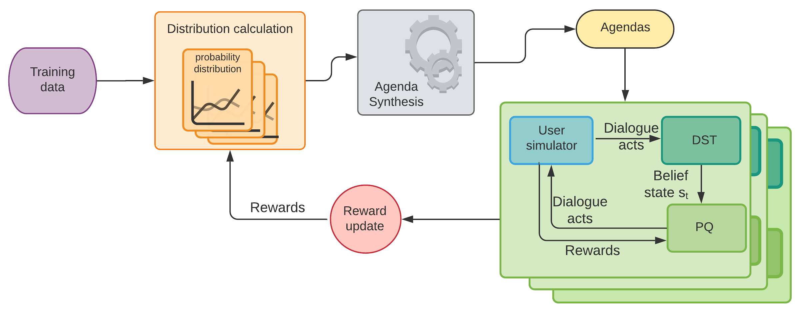
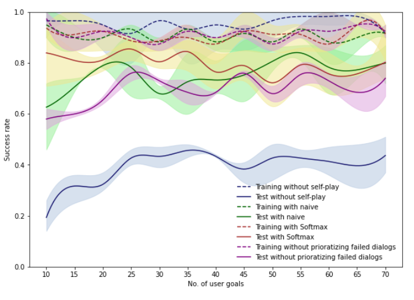
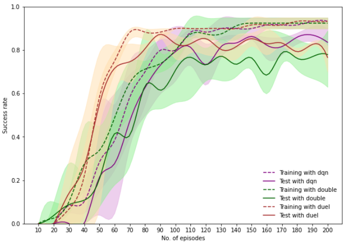

# Dialogue policy optimization in low resource setting

![project] ![research]


- <b>Project Lead(s) / Mentor(s)</b>
    1. Name (talk forum profile link)
    2. Name (talk forum profile link)
- <b>Contributor(s)</b>
    1. Name (talk forum profile link)
    2. Name (talk forum profile link)

<b>Usefull Links </b>

- GitHub : <project_url>
- Talk Forum : <talk_forum_link>

---

## Summary

The dialogue policy optimization in task oriented conversational agents, employed in low resource setting, is an open research project. We have developed a novel approach for dialogue policy optimization using Reinforcement Learning. The methodology is based on Self-play and a novel sampling technique that prioritizes failed dialogues over successful ones.

## Description

A conversational agent or a typical dialogue system is a software which interprets and responds to statements, made by users in real time, in free-form natural language, with the purpose of retrieving desired information relevant to the task to which the agent is oriented. The dialogue manager of such a system uses a dialogue policy to decide what the agent should say at each point in the dialogue. Designing an efficient dialogue policy, that could essentially be used in real world dialogue system applications, encompasses numerous challenges. Accuracy of user responses being highly variable, user responses being relatively unconstrained, the user alone being aware, frequently, of his/her goal are just a few challenges to start off with. 
Thus, dialogue policy optimization is regarded as an open-research problem. Currently many state of the art methods, hinged on Reinforcement Learning (RL), are being deployed to address this problem. RL is an area of machine learning, where the agent is rewarded or punished by the user according to the state it returns for the given input. The agent continuously learns by taking suitable actions to maximize reward in a particular situation. When viewing dialogue management as a RL task, the reward function - which the agent tries to maximize - would be fulfilling the user's goal as efficiently as possible.
However, RL based methods tend to overfit in a low resource setting due to sample deficiency. To tackle this issue, we introduce a novel probability based Self-play method. Self-play, the new weapon in modern RL, is where the agent collects observations and learns by playing against itself. This technique rules out the need to offer direct supervision since all the information that the agent employs to learn comes from its own clone, empowering it to maximize its own objectives.
Nevertheless, this methodology could also lead to an insufficient exploration of agendas by the agent, since this method applies to a low number of samples. Therefore, we further refine the methodology by introducing a selective sampling method based on the reward function that prioritizes failed dialogue acts, where the agent actively decides on the agendas to be used. 

Project phases - **complete**

### Architecture Diagram

Diagram below shows the overall architecture of the system.



### Directory Structure
The important files and directories of the repository is shown below

    ├── src
        ├── deep_dialog
            ├── agents : contain RL agents
            ├── data : dialogue dataset with knowledge base and goals
            ├── dialog_system : contain dialogue manager
            ├── models : nlu and nlg models
            ├── nlg : Natural Language Generation Module
            ├── nlu : Natural Language Undersatanding Module 
            ├── qlearning : qlearning implementaiton in numpy
            ├── self_play : Self Play algorithm with reward based sampling
            ├── usersims : Agenda based user simualator
        ├── run_RL_experiment.py : To run the RL experiment on a given RL algorithm
        ├── run_RL.py : To run RL agent with the self-play and reward based sampling 
        ├── run.py : run agent without self-play and reward based sampling
        ├── user_goal_handler.py : run self-play and reward based sampling experiment varying number of samples
        ├── config.json : configuration file for user_goal_handler
        └── config_rl.json : configuration file for run_RL_experiment

### Requirements 

The system is implemented using Python version 2(Since the simulator we used is implemented using Python 2)

The following requirements are called for.
```commandline
numpy
pandas
PyTorch
collections
typing
```
## Running Dialogue Agents

### Rule Agent
```sh
python run.py --agt 5 --usr 1 --max_turn 40
	      --episodes 150
	      --movie_kb_path ./deep_dialog/data/movie_kb.1k.p
	      --goal_file_path ./deep_dialog/data/user_goals_first_turn_template.part.movie.v1.p
	      --intent_err_prob 0.00
	      --slot_err_prob 0.00
	      --episodes 500
	      --act_level 0
```

### Cmd Agent
NL Input
```sh
python run.py --agt 0 --usr 1 --max_turn 40
	      --episodes 150
	      --movie_kb_path ./deep_dialog/data/movie_kb.1k.p
	      --goal_file_path ./deep_dialog/data/user_goals_first_turn_template.part.movie.v1.p
	      --intent_err_prob 0.00
	      --slot_err_prob 0.00
	      --episodes 500
	      --act_level 0
	      --run_mode 0
	      --cmd_input_mode 0
```
Dia_Act Input
```sh
python run.py --agt 0 --usr 1 --max_turn 40
	      --episodes 150
	      --movie_kb_path ./deep_dialog/data/movie_kb.1k.p 
	      --goal_file_path ./deep_dialog/data/user_goals_first_turn_template.part.movie.v1.p
	      --intent_err_prob 0.00
	      --slot_err_prob 0.00
	      --episodes 500
	      --act_level 0
	      --run_mode 0
	      --cmd_input_mode 1
```

### End2End RL Agent
Train End2End RL Agent without NLU and NLG (with simulated noise in NLU)
```sh
python run.py --agt 9 --usr 1 --max_turn 40
	      --movie_kb_path ./deep_dialog/data/movie_kb.1k.p
	      --dqn_hidden_size 80
	      --experience_replay_pool_size 1000
	      --episodes 500
	      --simulation_epoch_size 100
	      --write_model_dir ./deep_dialog/checkpoints/rl_agent/
	      --run_mode 3
	      --act_level 0
	      --slot_err_prob 0.00
	      --intent_err_prob 0.00
	      --batch_size 16
	      --goal_file_path ./deep_dialog/data/user_goals_first_turn_template.part.movie.v1.p
	      --warm_start 1
	      --warm_start_epochs 120
```
Train End2End RL Agent with NLU and NLG
```sh
python run.py --agt 9 --usr 1 --max_turn 40
	      --movie_kb_path ./deep_dialog/data/movie_kb.1k.p
	      --dqn_hidden_size 80
	      --experience_replay_pool_size 1000
	      --episodes 500
	      --simulation_epoch_size 100
	      --write_model_dir ./deep_dialog/checkpoints/rl_agent/
	      --run_mode 3
	      --act_level 1
	      --slot_err_prob 0.00
	      --intent_err_prob 0.00
	      --batch_size 16
	      --goal_file_path ./deep_dialog/data/user_goals_first_turn_template.part.movie.v1.p
	      --warm_start 1
	      --warm_start_epochs 120
```

## Running Experiment

### Experiment 01 : To compare our approach with a baseline

The experiment 01 is run to measure the performance of Self-play approach against a baseline model. Consequently, we have run the experiment with and without Self-Play, as well as with and without Reward based sampling.

The experiment is run, varying a number of training samples. To setup a minimum and maximum number of samples edit user_goal_hendler.py

Further, the configuration file for running experiment 01 is config.json

To run the experiment 

```commandline
python user_goal_handler.py
```
### Experiment 02 : To measure the rate of convergence

The experiment 02 is conducted to measure the rate of convergence of the Self-play approach and to check whether there is an apparent lag between training success rate and test success rate.

The configuration file for running experiment 02 is config_rl.json

```commandline
python run_RL_experiments.py
```

***The results from experiments are shown in the Results Section***

## Results

For both experiments, the dotted lines indicate training success rate while the solid lines indicate the test success rate.

### Experiment 01


### Experiment 02



## More references

We have used the user simulator described in [A User Simulator for Task-Completion Dialogues](http://arxiv.org/abs/1612.05688) as the simulator. Github link to the user simulator can be found on [here](https://github.com/MiuLab/TC-Bot).

Main papers to be cited are as follows.

```
@inproceedings{Tharindu2020Dialog,
  title={Dialog policy optimization for low resource setting using Self-play and Reward based Sampling},
  author={Tharindu Madusanka, Durashi Langappuli, Thisara Welmilla Uthayasanker Thayasivam and Sanath Jayasena},
  booktitle={34th Pacific Asia Conference on Language, Information and Computation},
  year={2020}
}
```

### License

Apache License 2.0

### Code of Conduct

Please read our [code of conduct document here](https://github.com/aaivu/aaivu-introduction/blob/master/docs/code_of_conduct.md).

[project]: https://img.shields.io/badge/-Project-blue
[research]: https://img.shields.io/badge/-Research-yellowgreen
